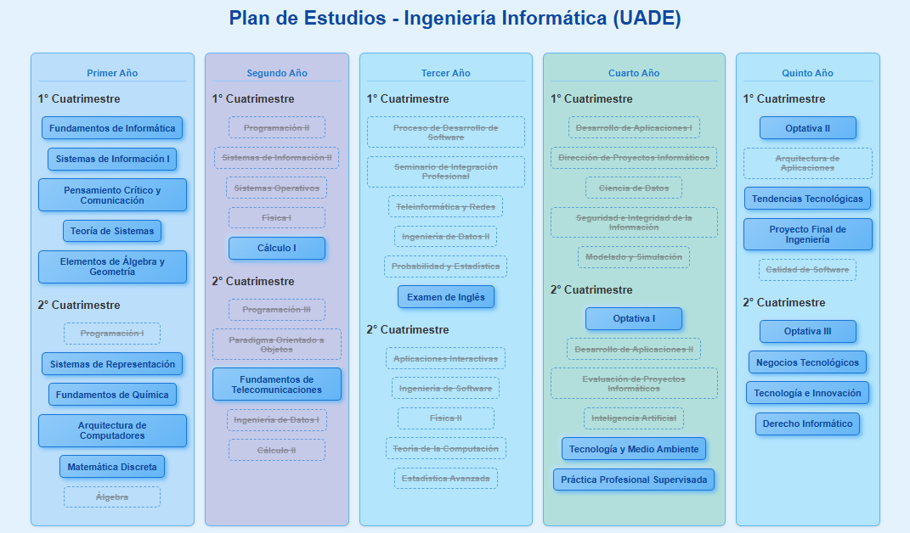

# Malla Interactiva - Ingeniería Informática (UADE)

Este es un proyecto web interactivo que muestra el plan de estudios de la carrera de Ingeniería Informática en UADE, visualmente organizado por año y cuatrimestre.

---

### Vista previa



---

### ¿Qué hace?
- Podés marcar materias como **aprobadas** haciendo clic.
- Las **correlativas** se bloquean o desbloquean automáticamente.
- Se guarda tu progreso en el navegador (localStorage).
- Tenés un botón para **reiniciar todo** si querés empezar de nuevo.

### ¿Cómo funciona?
Cada materia tiene un `data-id` único y un listado de correlativas en `data-correl`. Con algo de JavaScript se va gestionando el estado (aprobada, bloqueada, etc.) y se guarda tu progreso localmente.

### Tecnologías usadas
- HTML
- CSS 
- JavaScript (para la lógica de interacción)


### Cómo usarlo
1. Cloná el repo:
   ```bash
   git clone https://github.com/tu-usuario/malla-uade.git